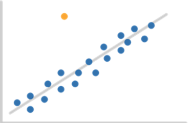

<!-- README.md is generated from README.Rmd. Please edit that file -->

# qacOutliers



<!-- badges: start -->
<!-- badges: end -->

The goal of qacOutliers is to detect univariate and multivariate
outliers for a variety of methods. This package consolidates methods
from a range of R packages and makes them more easily accessible.
Additionally, original methods for visualizing the results are provided.

## Installation

You can install the development version of qacOutliers from
[GitHub](https://github.com/chenning2011) with:

``` r
# install.packages("remotes")
remotes::install_github("https://github.com/chenning2011/qacOutliers/")
```

## How to use

To learn more about how to use this package, what outliers are, and the
different functions available in this package, visit the [Getting
Started](https://chenning2011.github.io/qacOutliers/articles/qacOutliers.html),
[Univariate](https://chenning2011.github.io/qacOutliers/articles/Univariate.html),
and
[Multivariate](https://chenning2011.github.io/qacOutliers/articles/Multivariate.html)
vignettes. You can find out more about how the specific functions work
on the
[Documentation](https://chenning2011.github.io/qacOutliers/reference/index.html)
page.
